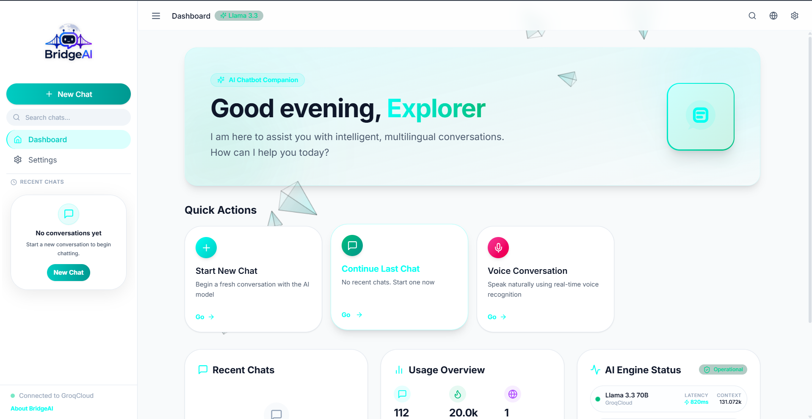
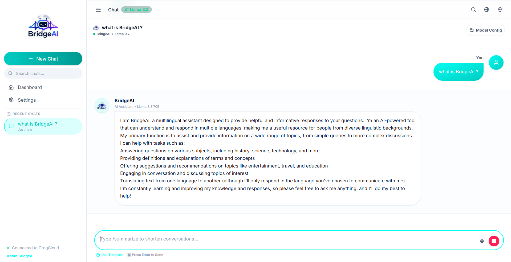
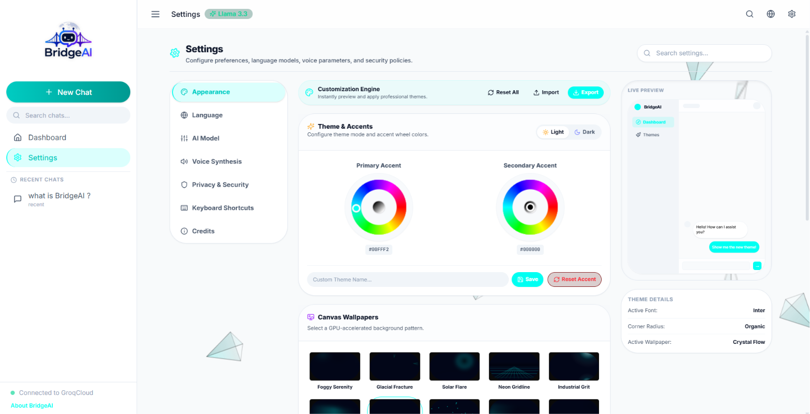
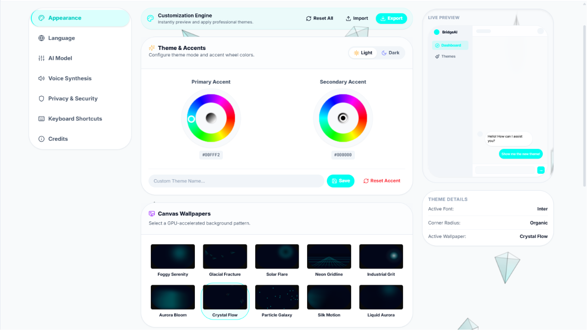
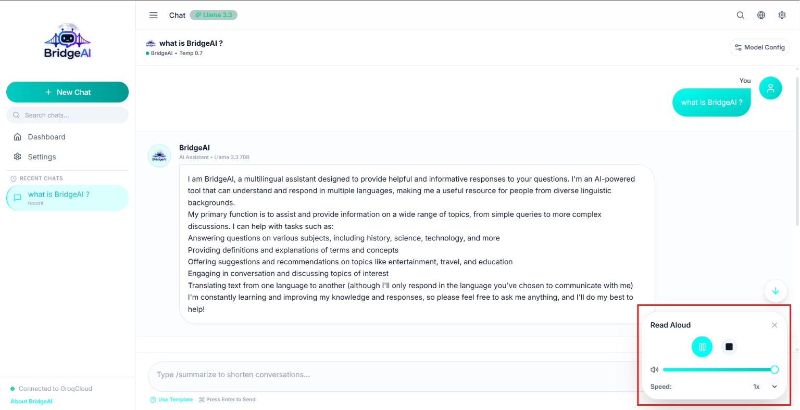
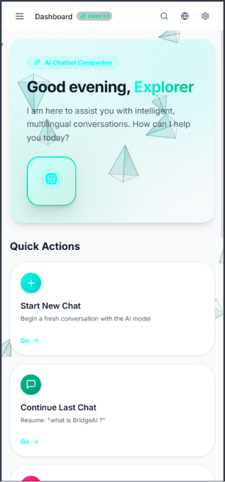

<div align="center">


# BridgeAI

### Bridging Human Intelligence with Artificial Intelligence.

*A modern, multilingual AI chatbot platform with real-time streaming, voice, theming, and analytics — built for speed, beauty, and extensibility.*

[](#-license)
[](frontend)
[](backend)
[](https://groq.com)
[](frontend)
[](frontend)
[](#-contributing)

</div>

---

## 📑 Table of Contents

- [Overview](#-project-overview)
- [Features](#-features)
- [Tech Stack](#-tech-stack)
- [Architecture](#-project-architecture)
- [Screenshots](#-screenshots)
- [Installation](#-installation)
- [Environment Variables](#-environment-variables)
- [Theme Engine](#-theme-engine)
- [Performance](#-performance)
- [Roadmap](#-roadmap)
- [Contributing](#-contributing)
- [License](#-license)
- [Credits](#-credits)
- [Special Thanks](#-special-thanks)
- [Future Vision](#-future-vision)

---

## 🧭 Project Overview

**BridgeAI** is a fast, beautifully designed, multilingual AI chatbot platform powered by **GroqCloud's Llama 3.3 70B**, with a **MySQL** persistence layer and **Redis**-backed rate limiting.

### What is BridgeAI?

BridgeAI is a full-stack conversational AI application — a polished React frontend paired with a lightweight, production-minded Node.js/Express backend — designed to deliver near-instant, streaming AI responses with first-class support for multiple languages and voice.

### Why it was built

Most open-source chatbot UIs are either too minimal to feel "real," or too heavyweight to learn from. BridgeAI was built to sit in the middle: a clean, modern, fully-featured assistant interface that's simple enough to understand end-to-end, yet complete enough to demo, extend, or ship.

### Who it's for

- Developers who want a real-world reference architecture for an AI chat product
- Engineers exploring GroqCloud's ultra-fast LPU inference
- Teams that need a multilingual, voice-ready assistant starting point
- Anyone who wants a beautiful, themeable chat UI without rebuilding it from scratch

### Main Objectives

- 🚀 Deliver ultra-low-latency, streaming AI conversations
- 🌍 Support automatic multilingual detection and response
- 🎨 Provide a premium, highly customizable interface
- 🔒 Be production-aware: rate limiting, persistence, and sane defaults out of the box

### Key Highlights

| Highlight | Description |
|---|---|
| ⚡ Speed | 800+ tokens/sec streaming via GroqCloud's LPU inference engine |
| 🌍 Multilingual | Automatic language detection — no manual language switching |
| 🎙️ Voice-Ready | TTS pipeline with multiple provider support (ElevenLabs, Google, fallback) |
| 🎨 Themeable | Dynamic accent colors, light/dark themes, animated canvas wallpapers |
| 📊 Analytics | Built-in usage dashboard and activity insights |
| 🧠 Context Memory | Full conversation history stored in MySQL |

---

## ✨ Features

<details open>
<summary><b>🤖 AI</b></summary>

| Feature | Description |
|---|---|
| AI Chat | Real-time conversational interface powered by Llama 3.3 70B |
| Multilingual AI | Automatic language detection and response generation |
| Streaming Responses | Word-by-word token streaming for instant feedback |
| Read Aloud | Converts AI responses to natural speech |
| Markdown Rendering | Full GFM markdown support in chat bubbles |
| Code Highlighting | Syntax-highlighted code blocks via highlight.js |
| Code Copy | One-click copy for any code snippet |
| Image Upload | Attach images as part of a conversation |
| File Upload | Share files directly in chat |
| Chat History | Persistent, searchable conversation history |
| Search | Quickly find past conversations |
| Smart Suggestions | Contextual follow-up prompt suggestions |
| Context Awareness | Maintains full conversational context per session |

</details>

<details open>
<summary><b>🎙️ Voice</b></summary>

| Feature | Description |
|---|---|
| Voice Chat | Speak naturally with the assistant |
| Read Aloud | Listen to any AI response |
| Multiple Voices | Choose from several TTS voice profiles |
| Multilingual Speech | Speech synthesis across supported languages |
| Auto Language Detection | Detects spoken/written language automatically |
| Voice Settings | Fine-tune voice, speed, pitch, and volume |
| Speech Controls | Pause, resume, and skip playback in real time |

</details>

<details open>
<summary><b>🎨 Customization</b></summary>

| Feature | Description |
|---|---|
| Theme Engine | Switch between curated light and dark themes |
| Dynamic Accent Colors | Generate accent palettes from a live hue wheel |
| Canvas Wallpapers | Animated, GPU-friendly background wallpapers |
| Appearance Settings | Centralized control over fonts, density, and visuals |
| Responsive Design | Optimized layouts for desktop, tablet, and mobile |

</details>

<details open>
<summary><b>📈 Productivity</b></summary>

| Feature | Description |
|---|---|
| Dashboard | At-a-glance overview of activity and AI status |
| Usage Analytics | Charts and heatmaps of conversation activity |
| Keyboard Shortcuts | Power-user navigation and command palette |
| Export Chats | Save conversations for later reference |
| Search Conversations | Instantly locate any past chat |

</details>

---

## 🛠 Tech Stack

### Frontend

| Technology | Purpose |
|---|---|
| React 19 | Core UI library |
| TypeScript | Type-safe application code |
| Vite 6 | Build tool & dev server |
| Tailwind CSS v4 | Utility-first styling |
| Framer Motion | Animations & transitions |
| Zustand | Lightweight global state management |
| TanStack Query | Server-state & data fetching |
| React Router v7 | Client-side routing |
| Radix UI | Accessible, unstyled UI primitives |
| react-markdown + remark/rehype | Markdown, GFM, and math rendering |
| highlight.js | Code syntax highlighting |
| i18next | Internationalization (9 locales) |
| Recharts | Analytics charts and graphs |
| Zod + React Hook Form | Form validation |

### Backend

| Technology | Purpose |
|---|---|
| Node.js + Express | API server |
| GroqCloud SDK | LLM inference (Llama 3.3 70B / 3.1 8B) |
| MySQL (mysql2) | Persistent storage for users, conversations, messages |
| Redis | Caching & distributed rate limiting |
| express-rate-limit + rate-limit-redis | Request throttling |
| Helmet | HTTP security headers |
| Morgan | Request logging |
| langdetect | Server-side language detection |
| ElevenLabs / Google Cloud TTS | Text-to-speech providers |

---

## 🏗 Project Architecture

```
Frontend (React 19 + Vite + Tailwind + Framer Motion)
        ↓  REST / Streaming
Backend (Node.js + Express)
        ↓
GroqCloud API (Llama 3.3 70B / 3.1 8B)
        ↓
MySQL (conversations + messages)   Redis (rate limiting + cache)
```

### Folder Structure

```
bridgeai/
├── backend/
│   ├── src/
│   │   ├── config/          # Database, Redis, env, and migration setup
│   │   ├── routes/          # API routes (chat, tts)
│   │   ├── services/        # Business logic (Groq, Chat, TTS providers)
│   │   ├── middleware/      # Rate limiting
│   │   └── index.js         # Server entry point
│   ├── package.json
│   └── .env.example
│
├── frontend/
│   ├── src/
│   │   ├── app/             # App-level routing
│   │   ├── components/      # Shared UI, layout, and audio components
│   │   ├── features/        # Feature modules: chat, dashboard, settings, analytics, i18n
│   │   ├── hooks/           # Reusable React hooks
│   │   ├── lib/             # API client, audio engine, utilities
│   │   ├── store/           # Zustand state stores
│   │   └── types/           # Shared TypeScript types
│   ├── public/               # Static assets (logos, favicon)
│   ├── index.html
│   └── package.json
│
└── README.md
```

---

## 🖼 Screenshots

> Add your own screenshots below to showcase the live application.

| Dashboard | Chat |
|---|---|
|  |  |

| Settings | Theme Engine |
|---|---|
|  |  |

| Voice | Mobile View |
|---|---|
|  |  |

---

## ⚙️ Installation

### Prerequisites

- **Node.js** 20+
- **MySQL** server (local or remote)
- **Redis** server (local or remote)
- A **GroqCloud API Key** — [Get a free key](https://console.groq.com/keys)

### 1. Clone the Repository

```bash
git clone https://github.com/tusharmagar1/bridgeai.git
cd bridgeai
```

### 2. Backend Setup

```bash
cd backend

# Install dependencies
npm install

# Copy the environment template
cp .env.example .env

# Open backend/.env and fill in your real credentials
# ⚠️ Never commit backend/.env to version control

# Run database migrations
npm run db:migrate

# Start the backend in dev mode
npm run dev
```

Backend runs at **http://localhost:3001**

### 3. Frontend Setup

```bash
cd frontend

# Install dependencies
npm install

# Start the dev server
npm run dev
```

Frontend runs at **http://localhost:5173**

### 4. Build for Production

```bash
# Frontend
cd frontend
npm run build
npm run preview

# Backend
cd backend
npm start
```

---

## 🖼 Logo Processing Utility (Optional)

The repository includes a standalone helper script, **`process_logo.py`**, used to generate `logo.png` and `favicon.png` from a source image (background removal + favicon resizing). It is **not part of the running application** — the frontend and backend never call it.

It requires Python 3 with the following packages:

```bash
pip install pillow numpy
```

> ⚠️ The script currently contains hardcoded local file paths — update `input_jpg`, `out_logo`, and `out_favicon` in `process_logo.py` before running it on your machine.

```bash
python process_logo.py
```

---

## 🔐 Environment Variables

Configuration lives in `backend/.env`, based on `backend/.env.example`.

> ⚠️ **Never commit your real `.env` file.** Keep `.env.example` updated with placeholders only, and rotate any key that has ever been exposed.

| Variable | Required | Description |
|---|---|---|
| `PORT` | ✅ | Port the backend server listens on (default `3001`) |
| `NODE_ENV` | ✅ | `development` or `production` |
| `FRONTEND_URL` | ✅ in production | Allowed CORS origin for the deployed frontend |
| `GROQ_API_KEY` | ✅ | API key from [GroqCloud](https://console.groq.com/keys) |
| `DB_HOST` | ✅ | MySQL host |
| `DB_PORT` | ✅ | MySQL port (default `3306`) |
| `DB_NAME` | ✅ | MySQL database name |
| `DB_USER` | ✅ | MySQL username |
| `DB_PASSWORD` | ✅ | MySQL password |
| `REDIS_HOST` | ✅ | Redis host |
| `REDIS_PORT` | ✅ | Redis port (default `6379`) |
| `REDIS_PASSWORD` | optional | Redis password, if set |
| `RATE_LIMIT_WINDOW_MS` | optional | Rate-limit window in milliseconds |
| `RATE_LIMIT_MAX_REQUESTS` | optional | Max requests allowed per window |
| `ELEVENLABS_API_KEY` | optional | Enables the ElevenLabs TTS provider |
| `GOOGLE_APPLICATION_CREDENTIALS` | optional | Path to a Google Cloud service-account JSON for TTS |

---

## 🧩 Project Features (Detailed)

<details>
<summary><b>💬 Conversational Chat Engine</b></summary>

BridgeAI streams responses token-by-token from GroqCloud's LPU-accelerated inference, rendering markdown, math (KaTeX), and syntax-highlighted code in real time as the response arrives.
</details>

<details>
<summary><b>🌍 Multilingual Intelligence</b></summary>

Incoming messages are automatically language-detected on the backend (`langdetect`), and the frontend ships with 9 bundled locales (English, Spanish, French, German, Japanese, Korean, Chinese, Hindi, Arabic) via `i18next`.
</details>

<details>
<summary><b>🎙️ Voice & Text-to-Speech</b></summary>

A pluggable TTS provider system (`ElevenLabsProvider`, `GoogleTTSProvider`, with a `FallbackTTSProvider`) lets BridgeAI read responses aloud, with graceful fallback if a provider is unavailable or unconfigured.
</details>

<details>
<summary><b>📊 Analytics Dashboard</b></summary>

The analytics feature module includes usage charts, an activity heatmap, performance metrics, and stat cards — all built with Recharts and backed by local state stores.
</details>

<details>
<summary><b>🔒 Rate Limiting & Security</b></summary>

The backend uses `express-rate-limit` backed by Redis (`rate-limit-redis`) for distributed throttling, plus `helmet` for secure HTTP headers and `morgan` for structured request logging.
</details>

---

## 🎨 Theme Engine

BridgeAI ships with a fully dynamic visual theming system:

- **Light Themes** — clean, high-contrast palettes for daytime use
- **Dark Themes** — glassmorphism-inspired, low-glare dark surfaces
- **Dynamic Accent Colors** — generated on the fly from a live hue wheel
- **Hue Wheel** — pick any base color and the UI derives a coordinated palette
- **Canvas Wallpapers** — animated, GPU-rendered backgrounds that adapt to the active theme

All theme state is persisted locally so your preferences carry across sessions.

---

## ⚡ Performance

| Optimization | Benefit |
|---|---|
| **Vite** | Near-instant dev server startup and HMR |
| **Lazy Loading** | Route- and feature-level code is loaded on demand |
| **Code Splitting** | Smaller initial bundle, faster first paint |
| **Optimized Rendering** | Memoized components and selective re-renders |
| **GPU Animations** | Framer Motion + canvas effects run off the main thread where possible |
| **Responsive Layout** | Fluid layouts tuned for desktop, tablet, and mobile breakpoints |

---

## 🗺 Roadmap

- ✅ AI Chat with streaming responses
- ✅ Multilingual detection & i18n
- ✅ Voice / Text-to-Speech pipeline
- ✅ Theme Engine (light/dark, dynamic accents, wallpapers)
- ✅ Analytics Dashboard
- ✅ Keyboard shortcuts & command palette
- ⬜ User authentication & multi-user accounts
- ⬜ Conversation export (PDF / Markdown)
- ⬜ Plugin / tool-calling support
- ⬜ Mobile app (React Native)
- ⬜ Self-hosted deployment guide (Docker)

---

## 🤝 Contributing

Contributions are welcome! To contribute:

1. **Fork** the repository
2. **Create a branch** for your feature or fix
   ```bash
   git checkout -b feature/your-feature-name
   ```
3. **Commit** your changes with clear, descriptive messages
   ```bash
   git commit -m "feat: add your feature"
   ```
4. **Push** to your fork and **open a Pull Request**

### Guidelines

- Keep PRs focused — one feature or fix per PR
- Follow existing code style and folder conventions
- Test changes locally before submitting (`npm run lint`, `npm run typecheck`)
- Never commit `.env` files or secrets
- Be respectful and constructive in reviews and discussions

---

## 📄 License

This project is intended to be released under the **MIT License**.

> No `LICENSE` file is currently present in the repository — add a standard [MIT LICENSE](https://choosealicense.com/licenses/mit/) file at the project root to make this official before publishing.

---

## 👤 Credits

### Created by

# Tushar Magar

**AI Engineer • Python Developer • Machine Learning Enthusiast**

### Social Links

| Platform | Link |
|---|---|
| 💼 LinkedIn | [linkedin.com/in/tushar-magar-7b80a2255](https://www.linkedin.com/in/tushar-magar-7b80a2255/) |
| 💻 GitHub | [github.com/tusharmagar1](https://github.com/tusharmagar1) |

---

## 🙏 Special Thanks

- The **open-source community**, for the tools and libraries that power BridgeAI
- **GroqCloud**, for ultra-fast LPU inference
- The maintainers of **React**, **Vite**, **Tailwind CSS**, **Radix UI**, and **Framer Motion**
- Everyone who contributes feedback, issues, and pull requests

---

## 🔮 Future Vision

BridgeAI is evolving beyond a chatbot into a broader **intelligent assistant platform** — one focused on:

- 🧠 Deeper AI reasoning and tool-use capabilities
- ⚙️ Automation of everyday tasks and workflows
- 📈 Productivity features that adapt to how you work
- 🌍 Seamless multilingual communication for global users
- 🎨 A modern, delightful user experience that keeps getting better

---

<div align="center">

### BridgeAI

**Created with ❤️ by Tushar Magar**

© 2026 All Rights Reserved.

</div>
